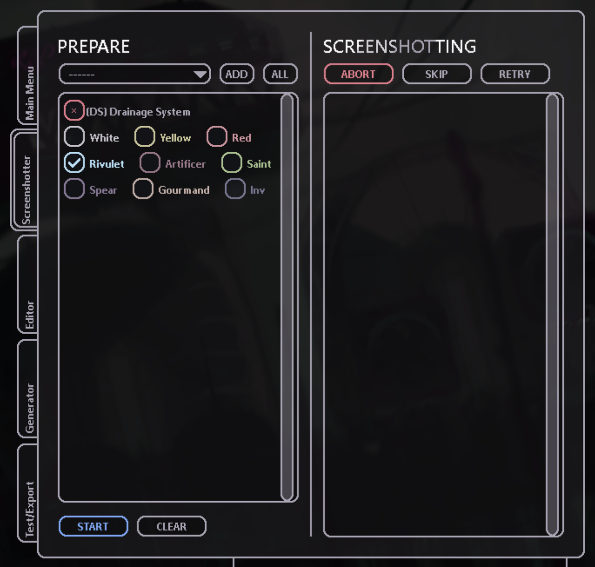

## Rain World - Region Locator

This project provides a set of python scripts for analyzing gameplay footage or screenshots from the game Rain World,
to allow identification of in-game regions, rooms, and room metadata.
It works by first capturing screenshots of the game,
then extracting easily comparable image hashes from the screenshots,
and finally matching those against the gameplay footage or screenshots.

I created this project to simplify my work when working on my
[Rain World Supercut](https://www.youtube.com/playlist?list=PLp9wK8t4o-F6Smv0YxEKJlYo3oHQsBIAr)
series, where it can be really useful to have a list of all the rooms and areas visited by the player
and to automatically generate timestamps to import into my project files.

Examples for the output:

- Analysis results of a video file:
    - [CSV](doc/Gourmand%20-%20Rain%20World%20Blind%20%2332%20%5BWOU3KgRc13g%5D-converted.csv)
    - [HTML](doc/Gourmand%20-%20Rain%20World%20Blind%20%2332%20%5BWOU3KgRc13g%5D-converted.html)
    - [Markdown](doc/Gourmand%20-%20Rain%20World%20Blind%20%2332%20%5BWOU3KgRc13g%5D-converted.md)

## How to run this project

### Setup

Well, first off install all the dependencies by running:

```bash
pip install -r requirements.txt
```

### Order to run the scripts

Preparation:

1. [Rain World Screenshots](#rain-world-screenshots):
   Create the screenshots of the game you want to analyze.
2. [extract_hashes.py](#extract_hashespy):
   Run this script once to generate the hashes for the images you want to analyze.

Only one image:

1. [match_image_hash.py](#match_image_hashpy):
   Run this script to match a single image against the hashes and see the result.
   You can adapt this script to your needs.

For a video:

1. [process_video.py](#process_videopy):
   This will process an entire video and save the results in a JSON file.
2. [interpret_overview_table.py](#interpret_overview_tablepy):
   This will convert the JSON file into a Markdown or HTML file, with aggregated data over time intervals.
3. [interpret_csv.py](#interpret_csvpy):
   Same as above, but in CSV format.

I will use https://www.youtube.com/watch?v=WOU3KgRc13g&list=PL68V5Cxs_CvTOxamvSacuCQ8mruxnnQ7X&index=33 as an example.

### Rain World Screenshots

Install the wonderful https://github.com/alduris/MapExporter into your
`SteamLibrary\steamapps\common\Rain World\RainWorld_Data\StreamingAssets\mods`
directory by simply extracting the latest release.

Then, run the game and in the Remix settings of the mod, use the "Screenshotter" tab to select all regions and slugcats
you are interested in.
Then, press the "Start" button and let the game run for a while.
The game will take screenshots of all the regions you selected.

They will appear in the
`SteamLibrary\steamapps\common\Rain World\MapExport\Input` directory.
Remember that directory, you will need it later.



### extract_hashes.py

First, we will have to prepare the dataset to accelerate detection of similar images in later steps of the project.
To do this, we will use the `extract_hashes.py` script to generate unique image hashes from the screenshots.
The image hashes are compact representations of image data that enable efficient comparison and similarity detection.

**Arguments**:

- `base_dir`: The base directory containing the images (the screenshots from before).
- `--search_filter`: Optional: A comma-separated list of `slugcat/region` pairs or `slugcat` names to filter the
  extraction. Example: `gourmand/oe,artificer`.

**Example Command**:

```
python extract_hashes.py "I:\SteamLibrary\steamapps\common\Rain World\MapExport\Input" --search_filter "gourmand/oe,artificer"
Processing region: gourmand/oe
Hash extraction complete for [gourmand/oe]: I:\SteamLibrary\steamapps\common\Rain World\MapExport\Input\gourmand\oe\hashes.pkl
Processing region: gourmand/si
Hash extraction complete for [gourmand/si]: I:\SteamLibrary\steamapps\common\Rain World\MapExport\Input\gourmand\si\hashes.pkl
Processing region: gourmand/sl
Hash extraction complete for [gourmand/sl]: I:\SteamLibrary\steamapps\common\Rain World\MapExport\Input\gourmand\sl\hashes.pkl
...
```

The result will be multiple hashes files in each of the image directories.

### match_image_hash.py

If you only want to run the script for a single image, you will only have to use the `match_image_hash.py` file.
For an entire video, use the other scripts below.

The `match_image_hash.py` script performs hash-based similarity detection by matching a single image’s hash against the
database of pre-computed hashes.

It takes the base screenshot direcoty to parse the precomputed hashes and takes a search query image,
and then identifies whether the target image matches any of the images represented in the hash file.

def parse_arguments():
parser = argparse.ArgumentParser(description='Match an image to the dataset using image hashing.')
parser.add_argument('image_file', help='Path to the input image file.')
parser.add_argument('base_dir', help='Base directory containing images.')
parser.add_argument('--search_filter',
help='Comma-separated list of slugcat/region pairs or slugcat names to filter the search.')
return parser.parse_args()

**Arguments**:

- `image_file`: The image file to match against the hashes.
- `base_dir`: The base directory containing the images (the screenshots from before).
- `--search_filter`: Optional: A comma-separated list of `slugcat/region` pairs or `slugcat` names to filter the
  extraction. Example: `gourmand/oe,artificer`.  
  I highly recommend setting this to the slugcat you are interested in, or even better using only the regions you
  know the area can be in, not only for time optimization but also to avoid false positives.

In general, I would only use one slugcat at a time, since campaigns contain duplicate images of the same rooms.

**Example Command**:

```bash
python match_image_hash.py "vlcsnap.png" "I:\SteamLibrary\steamapps\common\Rain World\MapExport\Input" --search_filter "gourmand"
Best match found:
Slugcat: gourmand
Region: sl
Filename: sl_e02_2.png
Room Key: SL_E02
Hamming Distance: 5
Room Metadata:
  name: SL_E02
  subregion: Shoreline
  pos: [122.541, -228.491]
  hidden: False
  offscreenDen: False
  cameras: [[-220.0, -70.0], [803.0, -60.0], [1814.0, -64.0], [2827.0, -60.0], [3835.0, -61.0]]
  size: [258, 35]
  spawns: [[{'type': 'JetFish', 'count': 1, 'chance': -1.0, 'night': False, 'data': None, 'den': 4}], [{'type': 'JetFish', 'count': 1, 'chance': -1.0, 'night': False, 'data': None, 'den': 5}], [{'type': 'SeaLeech', 'count': 7, 'chance': -1.0, 'night': False, 'data': None, 'den': 6}], [{'type': 'SeaLeech', 'count': 7, 'chance': -1.0, 'night': False, 'data': None, 'den': 7}], [{'type': 'SeaLeech', 'count': 7, 'chance': -1.0, 'night': False, 'data': None, 'den': 8}]]
  tags: []
  objects: [{'type': 'DangleFruit', 'pos': [4553.111, 497.106], 'data': ['-584', '39', '2', '3']}, {'type': 'DangleFruit', 'pos': [4604.87, 443.402], 'data': ['-658', '1.000031', '2', '3']}, {'type': 'DangleFruit', 'pos': [4480.404, 514.378], 'data': ['0', '0', '2', '3']}, {'type': 'WaterNut', 'pos': [2732.3, 605.012], 'data': ['0', '0', '2', '3']}, {'type': 'WaterNut', 'pos': [2701.764, 613.551], 'data': ['0', '0', '2', '3']}, {'type': 'WaterNut', 'pos': [2675.079, 609.566], 'data': ['0', '0', '2', '3']}, {'type': 'DangleFruit', 'pos': [834.578, 592.184], 'data': ['-940', '-47', '2', '3']}, {'type': 'DangleFruit', 'pos': [752.138, 536.895], 'data': ['-872', '-152', '2', '3']}, {'type': 'DangleFruit', 'pos': [591.897, 574.864], 'data': ['-696', '-299', '2', '3']}, {'type': 'DangleFruit', 'pos': [563.143, 503.581], 'data': ['-394', '-397', '2', '3']}, {'type': 'Hazer', 'pos': [2534.436, 600.073], 'data': ['-67', '-97', '7', '10']}, {'type': 'Hazer', 'pos': [2451.398, 598.865], 'data': ['-414', '-71', '7', '10']}]
```

### process_video.py

The `process_video.py` script is there for batch-processing frames from a video file.
It will take a snapshot every `interval` seconds and process it.
Every `write_interval` snapshots, it will write the results to a JSON file (and every time the script ends).

In order to allow any script to build on the results of the `process_video.py` script,
the script saves the results in a JSON file.
A highly truncated example of the JSON file can be found in
[Gourmand - Rain World Blind #32 [WOU3KgRc13g]-converted.json](doc/Gourmand%20-%20Rain%20World%20Blind%20%2332%20%5BWOU3KgRc13g%5D-converted.json).

See the `interpret`-scripts below to see how to process the JSON file to obtain a useful result.

**Arguments**:

- `video_file`: The path to the video file to process.
- `base_dir`: The base directory containing the images (the screenshots from before).
- `--search_filter`: Optional: A comma-separated list of `slugcat/region` pairs or `slugcat` names to filter the
  extraction. Example: `gourmand/oe,artificer`.
- `--start_time`: Optional: The start time in seconds for processing the video. Default is 0 seconds.  
  Calculated by `start_time = hours * 3600 + minutes * 60 + seconds`.
- `--interval`: Optional: The interval in seconds between frames to process. Default is 10 seconds.
- `--write_interval`: Optional: Write the updated list every x intervals. Default is 10 intervals.  
  Mainly there to save the results in case the script crashes or is stopped.

**Example Command**:

```bash
python process_video.py "I:\raw\Gourmand - Rain World Blind #32 [WOU3KgRc13g]-converted.mp4" "I:\SteamLibrary\steamapps\common\Rain World\MapExport\Input" --search_filter "gourmand" --start_time 1174
[0:21:14] Match found - OE_RAIL03
[0:22:04] Match found - OE_CAVE10
[0:22:14] Match found - OE_RAIL03
[0:22:44] Match found - OE_RAIL03
...
Results written to Gourmand - Rain World Blind #32 [WOU3KgRc13g]-converted.json
```

### interpret_overview_table.py

The `interpret_overview_table.py` script converts the JSON output from the `process_video.py` script into either
Markdown or HTML format,
aggregating the average rooms and regions visited by the slugcat in individual time intervals.
The interval can be configured using the `--interval` argument.

**Arguments**:

- `json_file`: The path to the JSON file.
- `--format`: Optional. Specifies the output format. Choose `md` for Markdown or `html` for HTML. Default is `md`.
- `--output_file` or `-o`: Optional. The name of the output file. Defaults to `<json_filename>.md` or `.html` based on
  the format.
- `--interval` or `-i`: Optional. The interval duration in minutes. Default is 5 minutes.
- `--subregion_limit` or `-s`: Optional. The maximum number of subregions to include. Default is 10.

**Example Command**:

```bash
python interpret_overview_table.py "Gourmand - Rain World Blind #32 [WOU3KgRc13g]-converted.json" --format html --output_file "Gourmand - Rain World Blind #32 [WOU3KgRc13g]-converted"
Summaries saved to I:\raw\Gourmand - Rain World Blind #32 [WOU3KgRc13g]-converted.html
python interpret_overview_table.py "Gourmand - Rain World Blind #32 [WOU3KgRc13g]-converted.json" --format md --output_file "Gourmand - Rain World Blind #32 [WOU3KgRc13g]-converted"
Markdown file saved to Gourmand - Rain World Blind #32 [WOU3KgRc13g]-converted.md
```

**Output**:

An example can be found in
[Gourmand - Rain World Blind #32 [WOU3KgRc13g]-converted.html](doc/Gourmand%20-%20Rain%20World%20Blind%20%2332%20%5BWOU3KgRc13g%5D-converted.html)
or
[Gourmand - Rain World Blind #32 [WOU3KgRc13g]-converted.md](doc/Gourmand%20-%20Rain%20World%20Blind%20%2332%20%5BWOU3KgRc13g%5D-converted.md).

I highly recommend placing the generated files in the directory of the Rain World screenshots,
as the images are linked in the output.
Also, get the imagus browser extension to view the images by hovering over the links.
This way, I got the most out of the generated files.

### interpret_csv.py

The `interpret_csv.py` script converts the JSON output from the `process_video.py` script into a CSV format,
aggregating the average rooms and regions visited by the slugcat in individual time intervals.
The interval can be configured using the `--interval` argument.

**Arguments**:

- `json_file`: The path to the JSON file generated by `process_video.py`.
- `--output_file` or `-o`: Optional. The name of the output CSV file. Defaults to the same name as the JSON file with
  a `.csv` extension.
- `--interval` or `-i`: Optional. The interval duration in minutes for grouping events. Default is 5 minutes.
- `--subregion_limit` or `-s`: Optional. The maximum number of subregions to include in the summary. Default is 10.

**Example Command**:

```bash
python interpret_csv.py "I:\raw\Gourmand - Rain World Blind #32 [WOU3KgRc13g]-converted.json"
Summaries saved to I:\raw\Gourmand - Rain World Blind #32 [WOU3KgRc13g]-converted.csv
```

**Output**:

An example can be found in
[Gourmand - Rain World Blind #32 [WOU3KgRc13g]-converted.csv](doc/Gourmand%20-%20Rain%20World%20Blind%20%2332%20%5BWOU3KgRc13g%5D-converted.csv).

```csv
start_time,end_time,slugcat,area,rooms,filenames,subregions
0:19:34,0:24:34,gourmand,oe,"OE_S04, SL_B04",oe_s04_0.png; sl_b04_2.png,
0:54:34,0:59:34,gourmand,sl,"OE_RUIN10, SL_I01, SL_ROOF04, SL_AI","oe_ruin10_1.png; sl_i01_3.png; sl_roof04_3.png, sl_roof04_2.png; sl_ai_0.png","Looks to the Moon, Outer Expanse"
0:59:34,1:04:34,gourmand,oe,"OE_RUIN08, OE_RUIN10, SL_C06, SL_ECNIUS02",oe_ruin08_0.png; oe_ruin10_1.png; sl_c06_2.png; sl_ecnius02_0.png,"Outer Expanse, Shoreline"
```

## Quick-Reference

Perform on video:

```bash
python process_video.py "<path_to_video>" "<path_to_screenshots>" --search_filter "<slugcat_or_region_filter>"
python interpret_overview_table.py "<path_to_json>" --format html --output_file "<output_file_name>"
```
